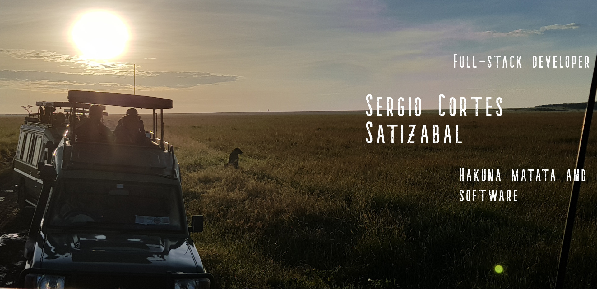

<p align="center">
  
</p>

<h1 align="center">
<strong>GOOD MORNING WORLD!</strong> 👋
</h1>
<br/>

<h3 align="center">
My name is Sergio Cortes Satizabal. A Full-Stack developer and business administrator passionate about life, people, and technology.
</h3>
<br/>

<h2 align='center'><strong>Technical-stack</strong></h2>
<br/>

<p align="center">
                
</p>
<br/>
<h2 align="center">
<strong>Connect with me: </strong>
<br/>
<br/>


[](sergiocortes.codes) [](https://twitter.com/sergiocortessat) [](https://www.linkedin.com/in/sergiocortessat/) [](mailto:sergiocortessat@gmail.com) [](https://angel.co/u/sergio-cortes-satizabal) [](https://medium.com/@sergiocortessatizabal) [](https://docs.google.com/document/d/1ceYZUjJyyr2tRFbnYzoLNJowETPmWlpKg8U_T5n8qT8/edit?usp=sharing)


<br/>

|My github statistics|Streaks|My languages|
|-|-|-|
|[](https://github.com/sergiocortessat)||[](https://github.com/sergiocortessat)
</h2>
  
<!-- 
</p> -->

```javascript
const Sergio = {
    otherStudies: ["Business administrator Magna Cum Laude and human relations emphasis"],
    canSpeak: ["English", "Spanish", "Portuguese"],
    hobbies: ["Writing", "Crypto", "Life"],
    otherSkills: {
        businessSkills:[
        "Product management",
        "Leadership", 
        "Product Development", 
        "Customer Success", 
        "Fintech and finance"
        ],
        softSkills: [
        "Blog writing",
        "Presentations",
        "Team work",
        "Business relations"
        ]
        otherTechnicalSkills: [
          "Git", 
          "VSCode", 
          "API",
          "Flask"
          ],
    },
    specialThingsAboutMe: [
    "Passionate about cultures, languages, behaviors, and communications overall",
    "Had the fortune to live in 5 different countries over 2 continents",
    "Wishing to learn Italian",
    "Empath and Campaigner. Always seeking a collective benefit.",
    "Life conversations",
    "In love with all that surrounds us"
    ],
};
```


<!-- ## About me

- Full-Stack developer
- Business administrator Magna Cum Laude with human relations emphasis (Minora Humanoura litterarum)
- English, Spanish, Portuguese
- Love to write in my spare time and think about life

## Other Skills

- Leadership
- Bitcoin and Blockchain knowledge certificate
- Knowledge on cryptos and Fintech Markets
- Blog writer
- Project management
- Project development

## Special things about me

- Passionate about cultures, languages, behaviors, and communications overall
- Passionate about writing all sorts of content. Technical and none technical
- Had the fortune to live in 5 different countries over 2 continents
- Wishing to learn someday in the future the wonderful Italian language
- Empath and Campaigner. Always seeking a collective benefit.
- Personal adviser of dozens of friends
- Life conversations
- In love with all that surrounds us -->

## 🤝 Things to see about me:

-- Check my Bitcoin presentation: [Bitcoin](https://tlr-coworking.com/blog/cryptocurrencies-an-experiment-that-will-lead-to-a-revolution%f0%9f%92%b0%f0%9f%92%b5%f0%9f%92%aa/)

-- Check this blog entry. Am proud of it and took me lots of pain to understand: [7 things I learned living in a hostel](https://medium.com/@sergiocortessatizabal/7-things-i-learned-living-in-a-hostel-293fa1638fd7)


## 📝 License

### HAKUNA MATATA 

License Copyright (c) 2021 sergiocortessat 
Permission is hereby granted, free of charge, to any person reading this to take a deep breath. Enjoy all that surrounds you. We are all forms of life going through this river. So just make sure you notice life's beautiful dichotomy.
