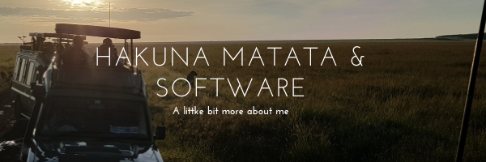

  

### GOOOOOOOD MORNIIIIIING WORLD! 👋

> My name is Sergio Cortes Satizabal. I am passionate about life, people, and software.

### Connect with me:

      

 |My github statistics|Streaks|My languages|
|-|-|-|
|||

  
<!--

-->

## About me

- Full-Stack-Developer
- Bussines Administrator Magna Cum Laude with human relations emphasis (Minora humaniorum litterarum)
- English, Spanish, Portugues
- Love to write in my spare time and think about life

## Technologies

- Ruby
- Rails
- React
- Redux
- Python
- Javascript
- Bootstrap
- Systems (Linux - Windows)
- Unit-Test

## Other Skills

- Leadership
- Bitcoin and Blockchain knowledge certificate
- Knowledge on cryptos and Fintech Markets
- Blog writer
- Project management
- Project development

## Special things about me

- Passionate about technology and software
- Passionate about cultures, languages, behaviors, and communications overall
- Passionate about writing all sorts of content. Technical and none Technical
- Had the fortune to live in 5 different countries over 2 continents
- Wishing to learn someday in the future the wonderful Italian language
- Empath and Campaigner. Always seeking a collective benefit.
- Personal adviser of dozens of friends
- Life conversations
- In love with all that surrounds us

## 🤝 Things to see about me:

-- Check my Bitcoin presentation: [Bitcoin](https://tlr-coworking.com/blog/cryptocurrencies-an-experiment-that-will-lead-to-a-revolution%f0%9f%92%b0%f0%9f%92%b5%f0%9f%92%aa/)

-- Check this blog entry. Am proud of it and took me lots of pain to understand: [7 things I learned living in a hostel](https://medium.com/@sergiocortessatizabal/7-things-i-learned-living-in-a-hostel-293fa1638fd7)

## 📝 License

### HAKUNA MATATA 

License Copyright (c) 2021 sergiocortessat 
Permission is hereby granted, free of charge, to any person reading this to take a deep breath. Enjoy all that surrounds you. We are all forms of life going through this river. So just make sure you notice lifes beautiful dichotomy.
